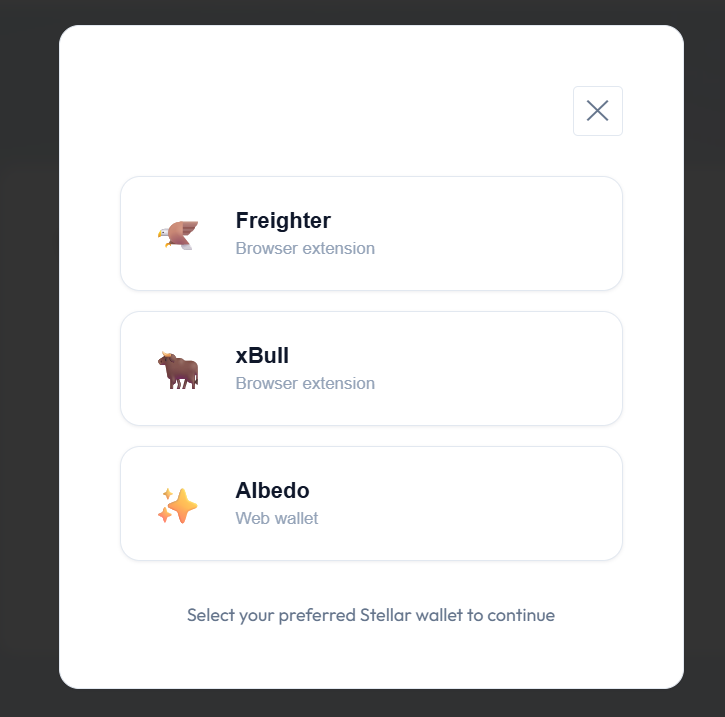

# Stellar Live Poll

A multi-wallet live polling dApp on Stellar testnet with Soroban contract integration, real-time vote event streaming, and on-chain transaction status.

**Author:** Abdulahad

## Live Demo

**https://stellar-yellow-abd.vercel.app**

**GitHub:** https://github.com/abdulahaddayater/stellar-yellow

---

## Features

- **Live Poll** — One-question poll with four options, voted on-chain via Soroban
- **Multi-Wallet Integration** — Freighter, xBull, and Albedo via StellarWalletsKit
- **Real-Time Events** — Live activity feed from contract `vote` events via SSE
- **Transaction Status** — Pending, success, and failure states with explorer links
- **Error Handling** — Wallet not found, user rejected signature, already voted
- **Responsive UI** — Clean indigo theme with live result bars

---

## Poll Question

> **Which Stellar feature excites you most?**

| Option | Choice |
|--------|--------|
| 1 | Smart Contracts (Soroban) |
| 2 | Asset Issuance |
| 3 | DEX & Trading |
| 4 | Cross-border Payments |

Each wallet address may vote once. Results update in real time as votes arrive.

---

## Wallet Options



| Wallet | Type |
|--------|------|
| Freighter | Browser extension |
| xBull | Browser extension |
| Albedo | Web-based |

---

## Deployment Details

### Contract Address (Testnet)

```
CDOCHIFTGNVVDMMELB6VRIBYIA265SIQMIRM36BP3MPYMWQCRWUIWZZV
```

**Verify on Stellar Expert:**  
https://stellar.expert/explorer/testnet/contract/CDOCHIFTGNVVDMMELB6VRIBYIA265SIQMIRM36BP3MPYMWQCRWUIWZZV

### Deploy Transaction Hash

```
525facfc177e3ae8064ace1ce2cd9c5bbc90461bcbf4d02a5eef12d23ec7e259
```

**Verify deploy tx:**  
https://stellar.expert/explorer/testnet/tx/525facfc177e3ae8064ace1ce2cd9c5bbc90461bcbf4d02a5eef12d23ec7e259

### Example Vote Transaction Hash

```
a7cd8383a3be67d77aa39c0a197e153d24db329946bddbf8063f24aef34b69bd
```

**Verify vote tx:**  
https://stellar.expert/explorer/testnet/tx/a7cd8383a3be67d77aa39c0a197e153d24db329946bddbf8063f24aef34b69bd

---

## Tech Stack

| Layer | Technology |
|-------|------------|
| Frontend | React 19 + Vite |
| Backend | Node.js + Express |
| Blockchain | Stellar Soroban |
| Wallets | @creit.tech/stellar-wallets-kit |
| Network | Stellar Testnet |

---

## Quick Start

### Prerequisites

- Node.js 18+
- Rust + Stellar CLI (for contract deploy)
- A Stellar testnet wallet (Freighter, xBull, or Albedo)

### Contract

```bash
cd contract/payment_tracker/contracts/hello-world
make build
stellar contract deploy --wasm target/wasm32v1-none/release/hello_world.wasm --network testnet
```

### Frontend

```bash
cd frontend
npm install
npm run dev
```

Runs at **http://localhost:5173**

### Backend

```bash
cd backend
npm install
npm start
```

Runs at **http://localhost:4000** (production backend at https://stellar-yellow-abd-backend.vercel.app)

---

## Project Structure

```
stellar-live-poll/
├── frontend/          # React poll app
├── backend/           # Express API + Soroban helpers
├── contract/          # Soroban Live Poll contract
├── screenshots/       # Submission screenshots
└── README.md
```

---

## Configuration

Set these in your **Vercel project settings** (or a local `.env` file — never commit it).

### Frontend (`stellar-yellow-abd.vercel.app`)

| Variable | Value |
|----------|--------|
| `VITE_CONTRACT_ID` | `CDOCHIFTGNVVDMMELB6VRIBYIA265SIQMIRM36BP3MPYMWQCRWUIWZZV` |
| `VITE_BACKEND_URL` | `https://stellar-yellow-abd-backend.vercel.app` |
| `VITE_NETWORK` | `TESTNET` |

**Local dev:** create `frontend/.env` with `VITE_BACKEND_URL=http://localhost:4000` (gitignored).

### Backend (`stellar-yellow-abd-backend.vercel.app`)

| Variable | Value |
|----------|--------|
| `CONTRACT_ID` | `CDOCHIFTGNVVDMMELB6VRIBYIA265SIQMIRM36BP3MPYMWQCRWUIWZZV` |
| `FRONTEND_URL` | `https://stellar-yellow-abd.vercel.app` |

`PORT` and `VERCEL` are set automatically by Vercel. CORS allows the frontend URL above plus localhost.

### Vercel project setup

| Project | Root Directory | URL |
|---------|----------------|-----|
| Frontend | `frontend` | https://stellar-yellow-abd.vercel.app |
| Backend | `backend` | https://stellar-yellow-abd-backend.vercel.app |

**Important:** Set the **Root Directory** to `frontend` (or `backend`) in each Vercel project. The frontend uses **Vite 7**, which requires **Node.js 20.19+** — a `.nvmrc` file is included (`22`).

If the frontend Root Directory is the repo root instead, the root `vercel.json` will build from `frontend/` automatically.

---

## Contract API

| Function | Description |
|----------|-------------|
| `cast_vote(voter, option)` | Cast a vote (1–4), emits `vote` event |
| `get_question()` | Returns poll question text |
| `get_vote_count(option)` | Vote count for an option |
| `get_total_votes()` | Total votes across all options |
| `has_voted(voter)` | Whether address already voted |
| `get_user_vote(voter)` | Option chosen (0 if none) |

---

## Level 2 Requirements Met

| Requirement | Implementation |
|-------------|----------------|
| 3 error types handled | Wallet rejected, already voted, simulation failed |
| Contract on testnet | `CDOCHIFTGNVVDMMELB6VRIBYIA265SIQMIRM36BP3MPYMWQCRWUIWZZV` |
| Contract called from frontend | `cast_vote` via wallet signature |
| Transaction status visible | Floating status bar + explorer links |
| Multi-wallet + real-time events | StellarWalletsKit + SSE event stream |

**Deliverable:** Multi-wallet Live Poll app with deployed contract and real-time event integration.

---

## License

MIT

**Built on Stellar by Abdulahad**

🔗 [GitHub Repository](https://github.com/abdulahaddayater/stellar-yellow)
